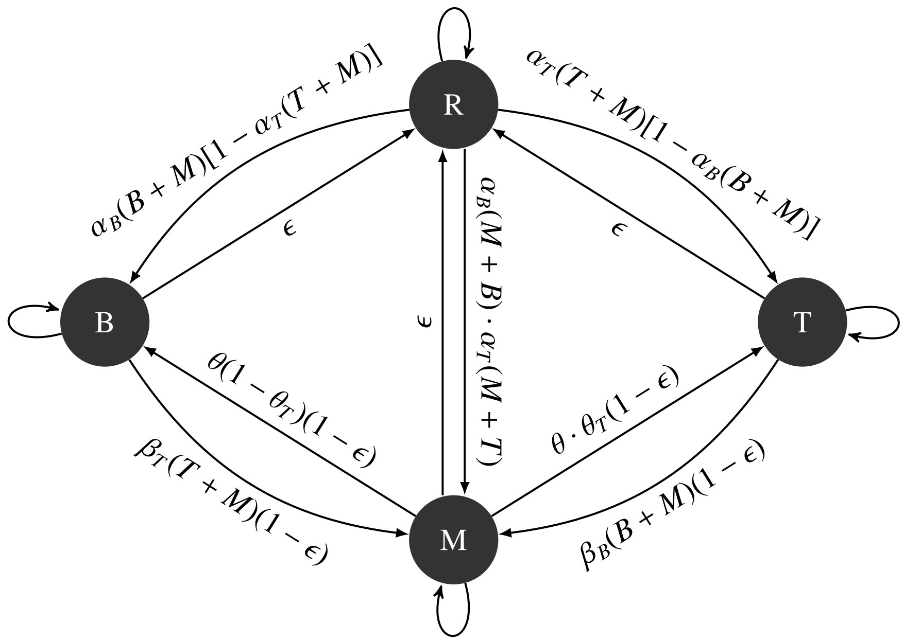

Linking SDMs and forest management
================
Willian Vieira
Wed Jun 28 11:26:34 2017

<!--Rscript -e "rmarkdown::render('README.md')" -->
Introduction
============

Here I am using a four states transition model (STM) to understand how forest management can increase forest resilience. The model has four process-parameters that defines the transition rate between the four states: Regeneration, Boreal, Temperate and Mixed (Figure 1).



Each parameter represents a different process: *α* is the colonisation rate (R -&gt; B, T, M), *β* the succession (B, T -&gt; M), *θ* the exclusion extintion (M -&gt; B, T) and *ϵ* the pertubation (B, T, M -&gt; R).

Example of model running
========================

``` r
# call the model
source("vissault_model.R")
```

#################################

Running the model to equilibrium
--------------------------------

#################################

``` r
# parameters
params = read.table("pars.txt", row.names = 1)

# Wrapper to collect parameters for a given set of environmental conditions
pars = get_pars(ENV1 = 0, ENV2 = 0, params, int = 3)
pars
```

    ##      alphab      alphat       betab       betat       theta      thetat
    ## 0.999991086 0.998278766 0.269252962 0.442427327 0.159791566 0.973086903
    ##         eps
    ## 0.009397677

``` r
# Get the transition matrix
transition_matrix = get_matrix(ENV1 = 0, ENV2 = 0, params, int = 3)
transition_matrix$MAT
```

    ##              R            B           M           T
    ## R 9.906906e-01 0.0000598863 0.003873647 0.005375876
    ## B 3.885079e-05 0.9354824254 0.064478724 0.000000000
    ## M 3.896877e-03 0.0017832562 0.929843330 0.064476536
    ## T 5.373681e-03 0.0000000000 0.001804291 0.992822028

``` r
# Equilibrium of the model for the specific parameters (pars)
eq = get_eq(pars)
eq
```

    ## $eq
    ##           B           T           M
    ## 0.004134084 0.571809507 0.414663890
    ##
    ## $ev
    ## [1] -0.1122421

`$eq` is the proportion of each state at equilibrium and `$ev` the eigenvalue

#################################

See the model behavior graphically
----------------------------------

#################################

Starting with 25% of the proportion for each state, we can graphically see the behavior of the model until reaching the equilibrium.

``` r
#data frame
time <- seq(1, 50, by = 0.1)
dm2 <- data.frame(matrix(NA, nrow = length(time), ncol = 4))

#Initial condition
y = c(B = 0.25, T = 0.25, M = 0.25)
dm2[1, ] = c(y, 0.25)

#loop
for(i in 2:length(time)) {
  eq = runsteady(y = y, func = model, parms = pars, times = c(0, i))[[1]]
  eq[4] <- 1 - eq[1] - eq[2] - eq[3]
  dm2[i, ] <- eq
}
```

``` r
#plot
par(family = 'serif', cex = 0.8)
plot(time, dm2[, 1],
     type = "l",
     ylim = c(0, max(dm2)),
     col = 2,
     ylab = "State proportion")
lines(dm2[, 2], col = 3)
lines(dm2[, 3], col = 4)
lines(dm2[, 4], col = 5)
legend(44, 0.18, c("B", "T", "M", "R"), col = 2:5, lty = 1, bty = "n", cex = 0.8)
```


#################################

Add hypothesized disturbance
============================

#################################

Setting up a data frame with two different environmnetal conditions is a way to see the behavior of the model after a disturbance. In this case, the model will start with 25% of the proportion for each state and after reaching equilibrium, the environmnetal patters will change.

``` r
#Function to produce the data frame with the equilibrium proportion of
#each state based on the environmnetal variation.
behavior <- function(envComb1, envComb2) {
    xx <- seq(1, 40, by = 1)
    dat <- data.frame(matrix(NA, nrow = length(xx), ncol = 6))
    names(dat) <- c("ENV1", "ENV2", "B", "T", "M", "R")
    dat[c(1:20), c(1,2)] <- envComb1 #environmnetal 1
    dat[c(21: dim(dat)[1]), c(1,2)] <- envComb2 #environmnetal 2

    #initial condition
    dat[1, c(3:6)] = c(B = 0.25, T = 0.25, M = 0.25, R = 0.25)

    #behavior
    for(i in 2:length(xx)) {
        pars = get_pars(ENV1 = dat[i, 1],ENV2 = dat[i, 2], params, int = 3)
        y = c(B = dat[(i - 1), 3], T = dat[(i - 1), 4], M = dat[(i - 1), 5])
        eq = runsteady(y = y, func = model, parms = pars, times = c(0, i))[[1]]
      eq[4] <- 1 - eq[1] - eq[2] - eq[3]
      dat[i, c(3:6)] <- eq
    }

    return(dat)
}
```

``` r
#run function
dat <- behavior(envComb1 = c(-.05, -.05), envComb2= c(0.05, 0.05))
```

``` r
#plot
par(family = 'serif', cex = 0.8)
plot(0,
     xlim = c(0, dim(dat)[1]),
     ylim = c(0, max(dat[,c(3:6)]) + 0.1),
     xlab = "time",
     ylab = "state proportion"
     )
lines(dat$B, col = 2)
lines(dat$T, col = 3)
lines(dat$M, col = 4)
lines(dat$R, col = 5)
legend(34, 0.25, c("B", "T", "M", "R"), col = 2:5, bty = "n", lty = 1)
```


#################################

Effect of forest management on resilience
=========================================

#################################

Using a numerical approach, I will take forest management into the model by changing the parameters related to each management process. For example, **plantation** can enhance colonization (*α*), pre-commercial **thinning** can enhance both competitive exclusion (*θ*) and succession (*β*), and **cutting** can enhance disturbance (*ϵ*; Figure 2). Dotted line is the base natural process that occur without intervention.

By simply increasing the value of each parameter related to management, we can simulate the inclusion of management in the model processes (see Figure 2). The **recovery resilience**, or time rate in which a system returns to equilibrium after a disturbance, is measured by the largest real part of the **eigenvalue**. The eigenvalue is optained by the Jacobian matrix and a nice example can be found in this [vignette](https://cran.r-project.org/web/packages/rootSolve/vignettes/rootSolve.pdf) of the `rootSolve` package.

As the choice of parameters is delicate in this kind of "*sensitivity analysis*", I chose to do 2 different tests in the parametric variation to simulate the response of resilience to the increasing in forest management.

`Test1` varies a specific parameter (the tested one) from 0 to 1.7, and the other parameters remains with the original values (fitted with field data). `Test2` varies a specific parameter from 0 to 1.7, and the other parameters remains with a fixed value `fixPar`.

### TEST 1

``` r
#Fixed value for main parameters from 0 to 1.7 and original value for the other parameters
int <- 2
parSeq <- seq(0, 1.7, 0.1)
```

``` r
#running eigenvalue to each parameter
pars = get_pars(ENV1 = 0, ENV2 = 0, params, int = int)
eql <- as.list("NA")
df <- data.frame()
for(k in 1: length(pars)) {
    pars = get_pars(ENV1 = 0, ENV2 = 0, params, int = int)
    for(j in 1: length(parSeq)) {
        pars[k] = parSeq[j]
        df[j, 1]    <- parSeq[j]
        df[j, 2] <- get_eq(pars)$ev
    }
eql[[k]] <- df
}

#plot
Pars <- c(expression(alpha), expression(alpha), expression(beta),
          expression(beta), expression(theta), expression(theta),
          expression(epsilon))
par(family = 'serif', cex = 0.8, mfrow = c(3,3), mai = c(0.3, .5, .2, .2))
for(i in 1:7) {
    plot(eql[[i]], type = "l", lwd = 1.7, xlab = "", ylab = "", ylim = c(-.35,0))
  if(i == 4) mtext(side = 2, "largest real part", line = 2.1, cex = 0.9)
  legend("bottomleft", Pars[i], bty = "n")
}
```


### TEST 2

``` r
#Fixed value for all parameters from 0 to 1.7
int <- 2
parSeq <- seq(0, 1.7, 0.1)
fixPar <- 0.5 #fixed value of all other parameters
```

``` r
#running eigenvalue to each parameter
pars = get_pars(ENV1 = 0, ENV2 = 0, params, int = int)
eql <- as.list("NA")
df <- data.frame()
for(k in 1: length(pars)) {
    pars = get_pars(ENV1 = 0, ENV2 = 0, params, int = int)
    pars[-k] <- fixPar
    for(j in 1: length(parSeq)) {
        pars[k] = parSeq[j]
        df[j, 1]    <- parSeq[j]
        df[j, 2] <- get_eq(pars)$ev
    }
eql[[k]] <- df
}
```

``` r
#plot
par(family = 'serif', cex = 0.8, mfrow = c(3,3), mai = c(0.3, .5, .2, .2))
for(i in 1:7) {
    plot(eql[[i]], type = "l", lwd = 1.7, xlab = "", ylab = "", ylim = c(-.5,0.05))
  if(i == 4) mtext(side = 2, "largest real part", line = 2.1, cex = 0.9)
  legend("bottomleft", Pars[i], bty = "n")
}
```


TODO
====

-   [](#section-7) In `Test2` add different lines for each fixed value: 0.2, 0.5, 0.8
-   [](#section-7) Solve differntial equantion to equilibrium
-   [](#section-7) Use `expand.grid` to test all possible variation between parameters
